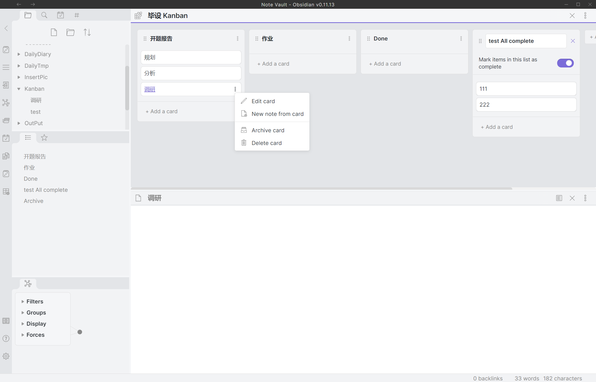

## Obsidian社区Kanban插件
一月份以来，我就从typora完全转向了obsidian，学习Zettelkasten 卡片盒笔记法，了解这种思想。（我是怎么使用obsidian的请看[笔记管理升级 - Mr.BelieVe's Treasure](http://mrbelieve.tech/2021/01/24/%E7%AC%94%E8%AE%B0%E7%AE%A1%E7%90%86%E5%8D%87%E7%BA%A7/)）

感谢我的老好友"Guilfoyle"，告诉我有大佬开发obsidian的看板工具了[mgmeyers/obsidian-kanban](https://github.com/mgmeyers/obsidian-kanban)

设置起来也是老样子

目前来看，基本功能齐全，New note就会保存在自己创建和设置的目录中。

但是目前来看(V0.1.2)，还有如下的问题
- Archive card之后就无法找回了
- Mark items as complete还没有效果
- 在文件名上只多加了Kanban，默认时创建的kanban文件也是保存在预设`Folder to create new notes in`里，若不留意容易遗忘在笔记堆里
- 目前Command里只有new kanban功能，查看以前看板之类的还没有

上述我会稍后整理成feature request发出去。但基本功能已足够使用。

我自己的发布至hexo插件也提上日程了，看见我请提醒我去写发布hexo插件。

## DevSecOps学习有感
Link: [从SDL到DevSecOps：始终贯穿开发生命周期的安全 - 安全客，安全资讯平台](https://www.anquanke.com/post/id/208353)

> 需要做的是进一步的流程融入，更加自动化，更多前置，以及安全文化的塑造
>
>流程：整合流程，定期做代码检查，红蓝对抗，建立安全情报机制等
>技术：构建对应的安全工具，实现更自动化的安全检测，相关工具可以嵌入到CI/CD流程中

说一个我想做的一方面，校园内网检测，目前只有每年的等保检查会强制扫描，安全做的差的学校，连扫描和攻击预警都没有。那么，做一个内网的定时自动检测扫描器，再按上poc自动更新的能力，这样，每当新的漏洞爆出来，poc出来了之后，扫描器的扫描能力也更上一层了。

