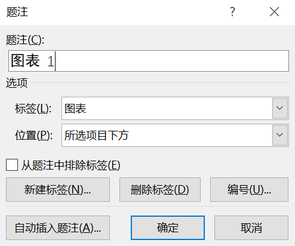
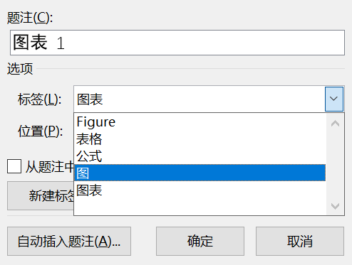
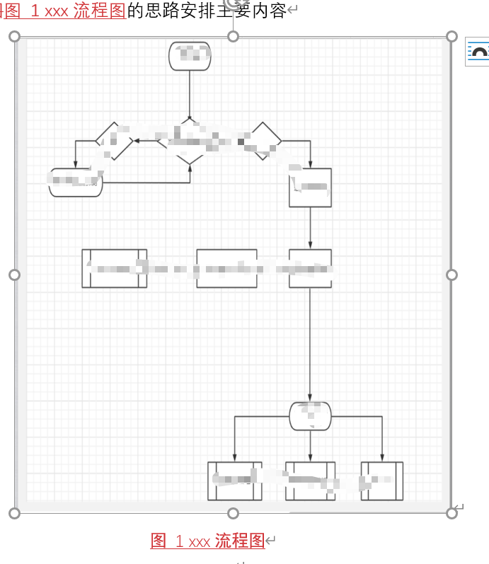
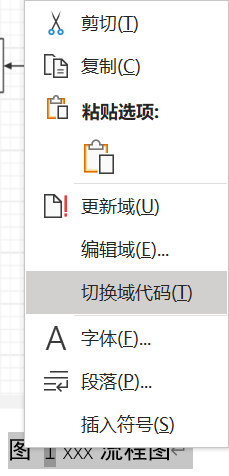

isPublish: No
Date: 2021-05-17 Monday
Category: 
tag: 
related: 

---

## Word一些小功能

最近在写申报书，靠大佬学到了一些word的便利操作，主要是插入图片下的说明文字/题注，以及在正文插入这些说明文字/题注。

### 插入图片下的说明文字

选择图片后，点击 引用-插入题注。

比如我其他能用的

编辑好后，就像我这里，在图1后加上xxx流程，回车后就如图

这样，多个图的增删之后，可以直接更新域来更新数字编号

### 正文插入这些说明文字/题注

引用-交叉引用里，即可插入。需要注意的是，图标下面的文字更新后，交叉引用不会自动更新，也需要右键进行手动更新。

## [多路非对称攻击：HTTP/2服务器上的下一代DDoS - 安全客，安全资讯平台](https://www.anquanke.com/post/id/232060)

对比和测试了HTTP/2和HTTP/1.1

> 性能有所提高，但HTTP/2服务器仍容易受到称为多路复用非对称攻击的新攻击媒介的攻击。已经证明，这种攻击可以导致一台服务器的攻击客户端数量减少到四个。还证明了，如果在HTTP/2服务器上启用了服务器推送，则使用多路复用的非对称攻击也可能导致网络层的出口泛洪攻击。

## 通过向日葵干掉杀软

[wafinfo/Sunflower_get_Password: 一款针对向日葵的识别码和验证码提取工具](https://github.com/wafinfo/Sunflower_get_Password)

通过解密/覆盖加密后的encry_pwd，即可远程控制他人电脑